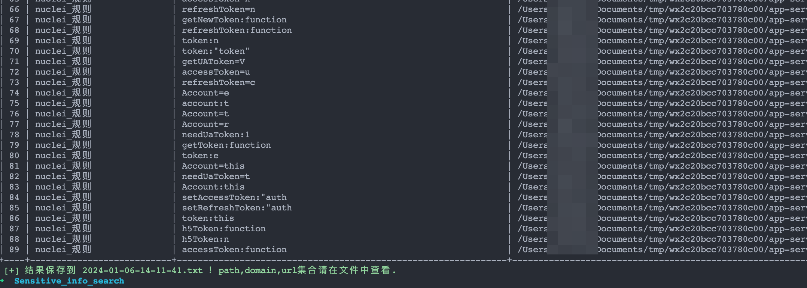

# ~~js_info_finder~~sensitive_info_search

一个js文件敏感信息搜集脚本，支持输入url和js文件，也支持批量敏感信息匹配。

# 二开说明 by best1a

1.合并了findsomething中的正则,去掉重复的日志信息

2.增加本地文件读取功能,指定文件夹全量搜索 -l参数指定即可

3.将正则中出现频繁和需要爆破的信息如path,url,domain合并整理到输出文件

以下为原作者说明:

主要基于正则表达式来提取敏感信息，正则表达式参考以下两个项目

1. [https://github.com/m4ll0k/SecretFinder](https://github.com/m4ll0k/SecretFinder)
2. [https://github.com/System00-Security/API-Key-regex](https://github.com/System00-Security/API-Key-regex)

有几项正则表达式误报比较多，可以根据自己的需要删除或增加相关的匹配项。

**实例**

